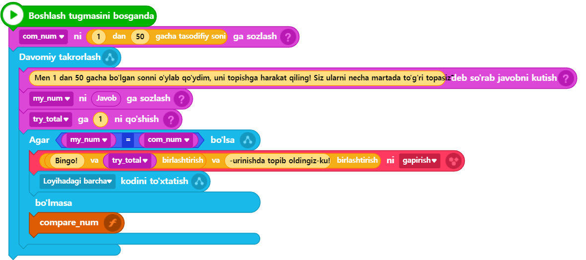

# 3.8 Funksiya (Function)

Nihoyat, endi bu bo‘limning oxirgi qismi — funksiya mavzusi qoldi. Funksiyalarni biz hozirgacha faqat kimdir biz uchun oldindan yaratib qo‘ygan funksiyalarni chaqirib ishlatib ko‘rganmiz. Ammo o‘zimizning funksiyalari(foydalanuvchi funksiyalari)mizni hali hech qachon yaratib ko‘rmaganmiz. Endi esa shu funksiyalarni o‘zimiz yozishni sinab ko‘ramiz. [3.7-bo‘lim](tasodifiy_son.md)da yozgan o‘yin kodimizning ayrim qismlarini funksiya sifatida alohida amalga oshirib, xuddi shu funksionallikni qayta bajarish orqali funksiyalarni o‘rganamiz.

Avval kodning qaysi qismini foydalanuvchi funksiyasi(o‘zimizning shaxsiy funksiyamiz) sifatida alohida ajratib yaratishni aniqlashimiz kerak. Masalan, foydalanuvchi kiritgan son bilan kompyuter o‘ylagan sondan farqini solishtirish qismiga e'tibor qaratamiz. Shu qismni ajratib, o‘zimizning foydalanuvchi funksiyamizni yaratamiz va ikki sonni solishtirish vazifasini shu funksiyaga topshiramiz.



<figure><figcaption></figcaption></figure>



<figure><figcaption></figcaption></figure>




```python
# (1)Entrybot's Python code
import Entry

com_num = 0
my_num = 0
try_total = 0

def when_start():
    com_num = random.randint(1, 50)
    
    while True:
        Entry.input("Men 1 dan 50 gacha bo'lgan sonni o'ylab qo'ydim, uni topishga harakat qiling! Siz ularni necha martada to'g'ri topasiz?")
        my_num = Entry.answer()
        try_total += 1
        
        if my_num == com_num:
            Entry.print("Bingo! " + try_total + "-urinishda topib oldingiz-ku!")
            Entry.stop_code("all")
        else:
            if my_num < com_num:
                Entry.print(my_num + " dan katta son")
            else:
                Entry.print(my_num + " dan kichik son")
            Entry.wait_for_sec(2)
```




<figure><figcaption></figcaption></figure>




```python
# (1)Entrybot's Python code
import Entry

com_num = 0
my_num = 0
try_total = 0

def compare_num(num1, num2):
    if my_num == com_num:
        Entry.print("Bingo! " + try_total + "-urinishda topib oldingiz-ku!")
        Entry.stop_code("all")
    else:
        if my_num < com_num:
            Entry.print(my_num + " dan katta son")
        else:
            Entry.print(my_num + " dan kichik son")
        Entry.wait_for_sec(2)

def when_start():
    com_num = random.randint(1, 50)
    
    while True:
        Entry.input("Men 1 dan 50 gacha bo'lgan sonni o'ylab qo'ydim, uni topishga harakat qiling! Siz ularni necha martada to'g'ri topasiz?")
        my_num = Entry.answer()
        try_total += 1
        
        compare_num(my_num, com_num)
```




Biz ushbu bo‘limning [birinchi bob](hello_world.md)ida funksiyalarni qanday yaratishni o‘rganganimiz sababli, agar hali funksiyalarni yaratish sintaksisini tushunishda qiyinchiliklar bo‘lsa, o‘sha bo‘limga qaytib, uni takrorlashni tavsiya qilamiz.

🔢 8\~17-qatorlardagi kod [avvalgi dastur kodi](tasodifiy_son.md)ning 16\~24-qatorlarini ajratib, **compare\_num** deb nomlangan foydalanuvchi funksiyasini yaratishga bag‘ishlangan. Ushbu funksiya ikkita sonli qiymatlarini parametr sifatida qabul qiladi va funksiya ichida bu ikkita sonlarning kattaliklarini solishtirish natijasiga ko‘ra shartli bajarish natijasini ko‘rsatadi. Agar funksiyalarni yaratish va ulardan foydalanish usulini allaqachon o‘zlashtirgan bo‘lsangiz, bu qismni tushunishda hech qanday qiyinchilik bo‘lmaydi.

Biroq, ushbu foydalanuvchi funksiyasi amalda unchalik samarali emas, chunki **funksiyaning asosiy maqsadi — dastur kodidagi turli qismlarda takrorlanadigan funksionallikni bitta funksiya orqali almashtirib, umumiy kodni soddalashtirish, shu bilan birga kodning o‘qilishiga qulaylik yaratish va keyinchalik yana qaytadan yuzaga kelishi mumkin bo‘lgan kodni tahrirlash jarayonlarini osonlashtirishdir.** Ammo hozir yaratilgan foydalanuvchi funksiyasi bu maqsadga unchalik mos emas va asosan o‘rganish maqsadida — o‘z funksiyamizni yaratib, undan foydalanishni sinab ko‘rish uchun sun’iy misol sifatida yaratilganini aytish mumkin.

Bundan tashqari, **foydalanuvchi funksiyasini ko‘proq joyda ishlatish uchun imkon qadar umumiy funksionallikni amalga oshirgan ma’qul**. Masalan, hozirgidek kattalikni solishtirish + solishtirish natijasini ekranga chiqarishni birlashtirishdan ko‘ra (bunday holatda funksiya faqat muayyan kodlarda cheklangan holda foydalanish mumkin bo‘ladi), faqatgina kattalikni solishtirish funksionalligini alohida bir funksiya sifatida amalga oshirish yaxshiroq bo‘lardi. Ammo, afsuski, hozirgi Entry-Python darajasida bunday funksiyani yaratishning ba’zi cheklovlari bor (masalan, funksiyaning natija qiymatini funksiya chaqiruvchisiga qaytarish (return) funksiyasi amalga oshirilmagan). Shuning uchun bunday ko‘rinishda amalga oshirilganligini hisobga olish kerak.

Bundan tashqari, yuqorida ko‘rsatilgandek funksiya yozilganidan so‘ng "Boshlash" tugmasini bosib dasturni ishga tushirib, keyin uni yopganingizda, yaqinda yozgan funksiyangizning kutilmaganda yo‘qolgandek ko‘rinishi mumkin. Aslida, ushbu funksiya avtomatik ravishda blokli kodlashning "Funksiyalar" bo‘limiga ro‘yxatdan o‘tadi va kod u yerga ko‘chiriladi. Bu holat, afsuski, Entry-Pythonda funksiya yozishda foydalanuvchi uchun chalkashliklar keltirib chiqarishi mumkin bo‘lgan jihatlardan biridir.
