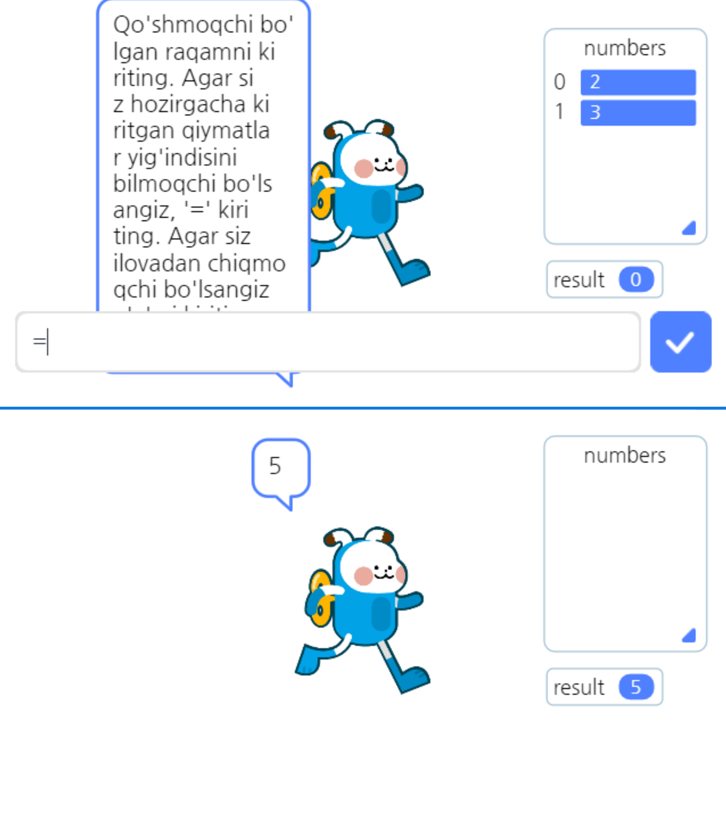
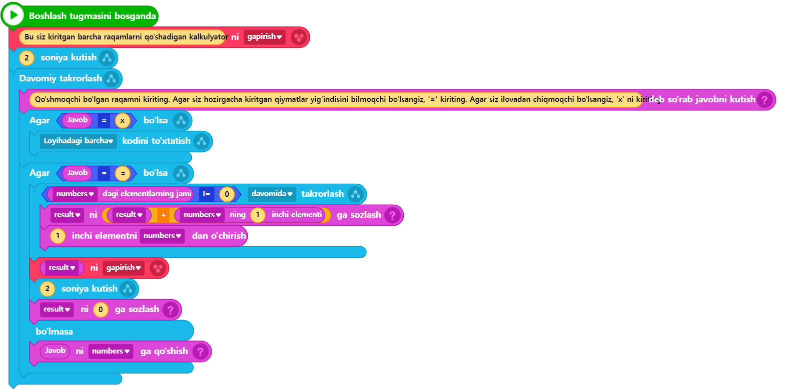
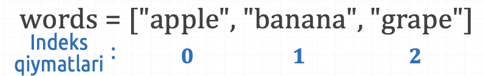
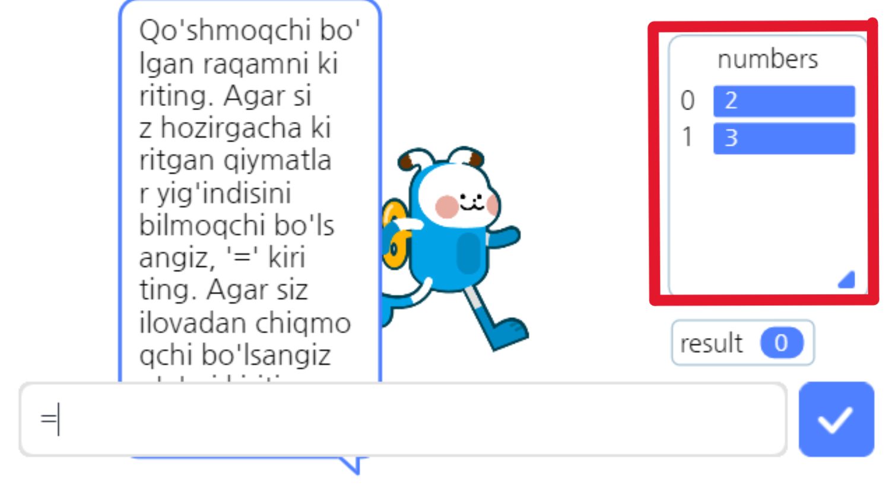

# 3.6 Ro‘yxat (List)

Blokli kodlashda ro‘yxat deb atalgan saqlash joyining maqsadi nima edi? Oldin **o‘zgaruvchi faqat bitta o‘zgaruvchan qiymatni (yoki oldindan aniq bo‘lmagan qiymatni) saqlagan bo‘lsa, ro‘yxat deb ataladigan saqlash joyi faqat bitta emas, balki bir nechta qiymatlarni saqlash imkonini beradi.**

Python tilida bunday joy ro‘yxat (list) deb ataladi, boshqa matnli dasturlash tillarida esa odatda "massiv" (array) deb yuritiladi.&#x20;

Blokli kodlashdagi ro‘yxatni Entry-Python matnli dasturlashida qanday ishlatish mumkin? Misol orqali Entry-Pythonda qanday kod yozish mumkinligini batafsil ko‘rib chiqamiz. [3.3-bo‘lim](uzgaruvchi.md)da yaratilgan faqat qo‘shish funksiyasiga mo‘ljallangan kalkulyator dasturidan foydalanib, ro‘yxatlar yordamida bu dastur foydalanuvchanligini yanada yaxshilash mumkin. [3.3-bo‘lim](uzgaruvchi.md)dagi kalkulyator foydalanuvchidan faqat ikkita tasodifiy qiymatni qabul qilib, ularning yig‘indisini hisoblaydi. Endi foydalanuvchi faqat ikkita qiymat emas, balki ko‘plab ketma-ket qiymatlarni kiritishi va kiritilgan barcha qiymatlarning umumiy yig‘indisini hisoblash imkoniyatiga ega bo‘lsa, bu foydalanuvchi uchun yanada qulayroq dastur(ilova)ga aylanadi.

Avval, ro‘yxatni qanday ishlatish mumkinligini belgilaydigan sintaksisni ko‘rib chiqamiz:

> ro‘yxat\_nomi = \[matn, raqam va boshqa bir nechta qiymatlar. Qiymatlar vergul ( , ) bilan ajratiladi]

Ro‘yxatning nomini xuddi o‘zgaruvchilar uchun nom qo‘yishda bo‘lgani kabi istalgan tarzda belgilash mumkin. Ammo, kod ma’nosini men yoki boshqa kishi tez va samarali tushunishi uchun har doim mazmunli nom berishga odatlanish kerak. Avval ham aytib o‘tganimizdek, bu odat dasturlash olamidagi asosiy fazilatlardan biridir.


Ro‘yxat nomini istalgancha belgilash mumkin bo‘lsada, aslida Python tilida ro‘yxatga nom qo‘yishda quyidagi ikki muhim qoidaga amal qilish kerak:

* Ro‘yxat nomi raqam bilan boshlanishi mumkin emas.&#x20;
* Ro‘yxat nomida bo‘sh joy bo‘lishi mumkin emas.


Quyida sintaksisga muvofiq yozilgan ro‘yxatlarning misollari keltirilgan:

words = \["apple", "banana", "grape"] &#x20;

numbers = \[1, 3, 10, 25, 2] &#x20;

complex = \["apple", 2, 32, "berry", 56, 5] &#x20;


**words** nomidagi ro‘yxatda satrli(string) turidagi 3 ta elementlar mavjud.

**numbers** nomidagi ro‘yxatda sonli turidagi 5 ta elementlar mavjud.

**complex** nomidagi ro‘yxatda satrli va sonli turidagi elementlar aralash holda 6 ta elementlar mavjud.


Hozirgacha biz ro‘yxatni aniqlash va bir vaqtning o‘zida boshlang‘ich qiymatlarni belgilashni o‘rgandik. Endi o‘rganishimiz kerak bo‘lgan narsa – ro‘yxat ichida saqlangan qiymatlarga(elementlarga) qanday murojaat qilish va ularni o‘qish, ro‘yxatga yangi qiymat qo‘shish yoki mavjud qiymatlarni o‘chirish usullari haqida. Yuqorida tilga olingan ro‘yxat bilan ishlash usullari bo‘yicha bilimlarni bu bo‘limda ko‘rib chiqamiz. Bundan tashqari, rivojlangan qo‘shish kalkulyatori dasturi uchun yozilgan kodlarni tahlil qilish orqali, ushbu usullarni amalda qanday qo‘llashni o‘rganamiz.



<figure><figcaption></figcaption></figure>



<figure><figcaption></figcaption></figure>




```python
# (1)Entrybot's Python code
import Entry

result = 0
numbers = []

def when_start():
    Entry.print("Bu siz kiritgan barcha raqamlarni qo'shadigan kalkulyator")
    Entry.wait_for_sec(2)
    
    while True:
        Entry.input("Qo'shmoqchi bo'lgan raqamni kiriting. Agar siz hozirgacha kiritgan qiymatlar yig'indisini bilmoqchi bo'lsangiz, '=' kiriting. Agar siz ilovadan chiqmoqchi bo'lsangiz, 'x' ni kiriting.")
        
        if Entry.answer() == "x":
            Entry.stop_code("all")
        
        if Entry.answer() == "=":
            while len(numbers) != 0:
                result = result + numbers[0]
                numbers.pop(0)
            
            Entry.print(result)
            Entry.wait_for_sec(2)
            result = 0
        else:
            numbers.append(Entry.answer())
```




🔢 Birinchidan, 5-qatorda **numbers** deb nomlangan ro‘yxatning e’lon qilinishi biroz g‘ayrioddiy. Ko‘rishimiz mumkinki, ro‘yxat dastlabki qiymatlarsiz, ya’ni u to'rtbuchak qavslar ichida hech qanday qiymatlarsiz e’lon qilingan (shunchaki to'rtburchak qavslar ochilgan va yopilgan). Bu kabi e’lon qilishning sababi mantiqan tushunarli: bizning ilovamiz foydalanuvchi cheklanmagan miqdorda kiritishi mumkin bo‘lgan sonlarni saqlash uchun vaqtinchalik joyga muhtoj. Shu maqsadga mos keladigan joy sifatida ro‘yxatdan foydalanamiz. Foydalanuvchi hech narsa kiritmagan bo‘lsa ham, ro‘yxat mavjud bo‘lishi kerak, shuning uchun ro‘yxatda hech elemetlarsiz bo‘sh holatda e’lon qilingan deb taxmin qilish mumkin.

🔢 Endi 26-qatorga nazar tashlaymiz. 26-qator ro‘yxatga foydalanuvchi kiritgan sonli qiymatini yangi element sifatida qo‘shish uchun yozilgan kodni ifodalaydi. Bu yerda **append** funksiyasi yordamida foydalanuvchi kiritgan qiymatni **Entry.answer()** orqali o‘qib, **numbers** ro‘yxatiga qo‘shyapmiz. Shu paytda **numbers.append()** deb chaqirilayotgan funksiyaning ro‘yxat nomi bilan bog‘langan holatda ishlatilayotgani qiziqarli ko‘rinadi. Bu qanday qilib ishlayapti? **Sababi shundaki, ro‘yxatning o‘zi obyekt (Object) hisoblanadi**, shuning uchun shunday obyekt ichidagi funksiyalarni chaqirish mumkin. Ammo obyektlar haqida batafsil tushuntirish ushbu kitobning doirasidan tashqariga chiqish kerak, bu mavzuga qiziquvchilar Pythonda obyektlarni boshqarishni alohida o‘rganishlarini tavsiya qilamiz. Hozircha shuni bilib olish kifoya: ro‘yxatga yangi element qo‘shish uchun **ro‘yxat\_nomi.append(qo‘shilayotgan qiymat)** sintaksisini ishlatish kerak.

🔢 Endi 18\~20-qatorlarni ko‘rib chiqamiz. Bu yerda **while** yordamida yozilgan takroriy sikl mavjud. Ammo sikl qachongacha davom etishini belgilovchi shart keltirilgan: **len(numbers) != 0**. Biz allaqachon "==" operatorining ma’nosini bilamiz. Biroq, "!=" operatorining ma’nosi nima? Bu aynan "==" operatorining aksi bo‘lib, ikki qiymat bir-biriga teng emasligini anglatadi. Shunday qilib, ushbu kodning ma’nosini tushuntiradigan bo‘lsak, **len(numbers)** funksiyasining qaytariluvchi(return) qiymati 0 ga teng bo‘lmaguncha sikl davom etadi.

Endi **len** funksiyasi nima ekanligini tushunishimiz kerak. Uning ishlatilishini ko‘rib chiqamiz, bunda qiziqarli jihat bor. Funksiyaning oldida uni qaysidir joydan (masalan, biror kutubxona nomidan, ro‘yxat nomidan yoki o‘zgaruvchi nomidan) chaqirilganini ko‘rmaymiz. Bu nimani anglatadi? Ya’ni, **bu funksiya biror joyga tegishli emas, balki Python tilining ichida standart tarzda o‘rnatilgan ichki funksiya ekanligini bildiradi.** Shu sababli, bu funksiyani hech qanday maxsus ko‘rsatmalarsiz, faqat nomini yozib chaqirsa bo‘ladi, va biz bunday funksiyalarni maxsus "**ichki funksiyalar**" deb ataymiz. Shunday qilib, **len** funksiyasi ichki funksiya bo‘lib, uning vazifasini nomidan ham tushunish mumkin: **length** (uzunlik) so‘zining qisqartmasi sifatida olingan. U ma’lum bir ma’lumotning hajmini (ya’ni, uning uzunligini) qaytaradi. Shu sababdan, bu yerda **len** funksiyasiga uzatilgan ma’lumot qiymati **numbers** deb nomlangan ro‘yxatdir. Natijada, bu ro‘yxatdagi elementlar jamini ko‘rsatadi. Masalan, agar 25-qator kodi bo‘yicha foydalanuvchi ikkita sonli qiymat kiritgan bo‘lsa, len funksiyasi yordamida ro‘yxatda hozir 2 ta element borligini aniqlash mumkin. Agar foydalanuvchi uchta sonli qiymat kiritgan bo‘lsa, len funksiyasi hozirgi elementlar jamini 3 deb ko‘rsatadi.

Yuqorida alohida-alohida tushunilgan ma’lumotlarni birlashtirib, ushbu kodni aniqroq talqin qiladigan bo‘lsak, _**len(numbers) != 0** sharti bilan ishlaydigan **while** sikli, oxir-oqibat, **numbers** ro‘yxatida birorta ham element qolmaguncha takrorlashni bildiradi._ Foydalanuvchi o‘zi xohlagancha qiymatlarni kiritgani sari **numbers** ro‘yxati elementlar bilan to‘ldiriladi. Ammo, "qanday qilib ro‘yxatda birorta ham element qolmasligi mumkin?" degan savol paydo bo‘lishi mumkin. Bu savolning javobini esa 19\~20-qatorlarni tahlil qilib topish mumkin.

🔢 19\~20-qatorlarda foydalanuvchi tomonidan **numbers** ro‘yxatiga kiritilgan sonli qiymatlarini birma-bir olib, ularning yig‘indisini hisoblash uchun yozilgan kod mavjud. Yuqorida biz ro‘yxat bilan ishlashning uch xil usulini o‘rgandik (yangi qiymat qo‘shish, mavjud qiymatni o‘qish, mavjud qiymatni o‘chirish), va ulardan bittasi — yangi qiymat qo‘shishni ko‘rdik. Endi esa ro‘yxatda saqlangan qiymatlarni o‘qish usulini o‘rganish vaqti keldi. Buni aniqroq tushunish uchun avvalo, sintaksis va ro‘yxatning indeks(index) orqali murojaat qilish degan tushunchasini o‘rganish kerak. Ro‘yxatning ma’lum bir elementini o‘qish uchun quyidagi sintaksis qo‘llaniladi:

> ro‘yxat\_nomi\[indeks]

Quyidagi misolda ko‘rganimizdek, ro‘yxatga element qo‘shilgan vaqtdan boshlab (ro‘yxatni aniqlash va boshlang‘ich qiymat berishda yoki yangi element qo‘shishda), Python ichki tizimi avtomatik tarzda ro‘yxat ichidagi har bir elementning tartib raqamini belgilaydi. **Bu tartib 0 dan boshlanadi va keyingi elementlar uchun birma-bir ortib boradi.** Bu indeks qiymatlari ichki tizimda mavjud bo‘lib, bizga ko‘rinmaydi, lekin ular yordamida ro‘yxat ichidagi har bir elementning qiymatini o‘qib olishimiz mumkin.

<figure><figcaption></figcaption></figure>

Agar biz **words** ro‘yxatidagi ikkinchi o‘rinda turgan "banana" elementini (qiymatini) o‘qimoqchi bo‘lsak, ro‘yxatdagi ma’lum bir o‘rindagi elementni o‘qish sintaksisiga muvofiq, **words\[1]** deb yozib, uni o‘qib olishimiz mumkin. Quyidagi rasmda ko‘rsatilganidek, ro‘yxat ichidagi qiymatlar va ularning indeks qiymatlari real vaqt rejimida vizual ko‘rinishda tasvirlangan. Bizning misolimizda bajarilish natijasi ekranda ko‘rinadi: chap yuqori burchakda **numbers** ro‘yxatida 2 va 3 qiymatlari o‘sha tartibda joylashganligini ko‘rishingiz mumkin. Ya’ni, foydalanuvchi avval 2 sonini kiritgan, keyin esa 3 sonini kiritgan.

<figure><figcaption></figcaption></figure>

🔢 19-qatorda **numbers\[0]** sintaksisi orqali **numbers** ro‘yxatidagi birinchi elementni o‘qib olib, uning qiymatini **result** deb nomlangan o‘zgaruvchiga saqlash vazifasi bajariladi. Keyingi, ya’ni 20-qator kodida nima sodir bo‘ladi? Bu yerda **numbers** ro‘yxati(obyekti) ichida joylashgan **numbers.pop()** funksiyasi chaqirilmoqda. Funksiyaning nomidan ham tushunish mumkinki, **pop** funksiyasi ro‘yxatdan ma’lum bir o‘rinda joylashgan qiymatni olib, uni o‘chirish uchun ishlatiladi. Ushbu funksiyani quyidagi shaklda chaqirib ishlatish mumkin: **ro‘yxat\_nomi.pop(o‘chirilishi kerak bo‘lgan elementning indeksi)**. Shunday qilib, 20-qatordagi **numbers.pop(0) ning ma’nosi** — ro‘yxatdagi birinchi elementni (indeks 0 ga ko‘ra) olib tashlashdir.

Bizning misolimizda yuqoridagi bajarilish natijasida (foydalanuvchi 2 va 3 sonlarini ketma-ket kiritgan holatda) ushbu kod bajarilgandan keyin ro‘yxatdagi birinchi qiymat, ya’ni 2 ro‘yxatdan o‘chiriladi. Shu bilan birga, undan keyin turgan 3 soni avtomatik ravishda o‘chirilgan 2 ning joyiga ko‘chadi va endi birinchi o‘rinda turadi. pop(0) funksiyasi har doim joriy vaqtda ro‘yxatning oldingi (birinchi) o‘rnida joylashgan qiymatni olib tashlashni anglatadi. Yuqoridagi kodni Entry muhitida ishga tushirib ko‘ring. Uni matnda o‘qib tushunishdan ko‘ra, vizual ko‘rib tushunish osonroq. Chunki Entry ushbu jarayonlarni bosqichma-bosqich ko‘rsatib, real vaqt rejimida vizual ko‘rsatmalar orqali tushunishni osonlashtiradi.

🔢 18\~20-qator kodlarini umumlashtirib qayta tahlil qiladigan bo‘lsak, **numbers** ro‘yxatida saqlanayotgan elementlarni birma-bir o‘qib, avvalgi yig‘indi qiymatiga (ya’ni, result o‘zgaruvchisiga) qo‘shish, so‘ng o‘qilgan qiymatni ro‘yxatdan o‘chirib tashlash jarayonlarini bajaradi. Ushbu jarayon, ro‘yxatda hech qanday element qolmaguncha davom ettiriladi. Bu kodning maqsadi — foydalanuvchi tomonidan kiritilgan barcha qiymatlarning yakuniy yig‘indisini hisoblashdir. Shu bilan birga, yig‘indi hisoblanayotganda ro‘yxatni tozalab, bo‘sh holatga keltirish ham amalga oshiriladi.

Boshidan qaytib, bizning maqsadimiz foydalanuvchidan cheksiz ravishda sonlarni qabul qilib, ushbu kiritilgan barcha sonlarning yig‘indisini hisoblash funksiyasiga ega bo‘lgan dasturni muvaffaqiyatli yaratish edi. Bu maqsadga erishildi. Albatta, ushbu funksiyani faqat yuqoridagi usulda dasturlash kerak degan qoidalar yo‘q. Bir xil funksiyani bir necha usul bilan amalga oshirish mumkin, va hozirgi kod shulardan faqat bittasidir. Aslida, bu kod Entry-Python emas, balki original Python bo‘lganida, yanada oddiy va samaraliroq kod yozish mumkin edi. Biroq, biz Entry-Pythonning imkon bergan sintaksis chegaralari doirasida kodlashimiz kerak, va shu bilan birga sizga ro‘yxat bilan ishlashning turli usullarini ko‘rsatish maqsadida aynan shunday tarzda kod yozilganini ham inobatga oling.
