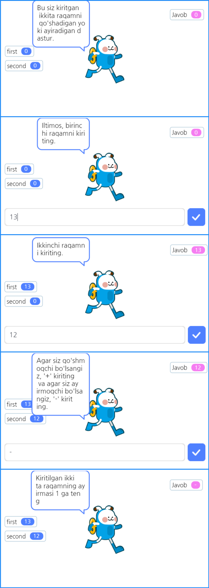
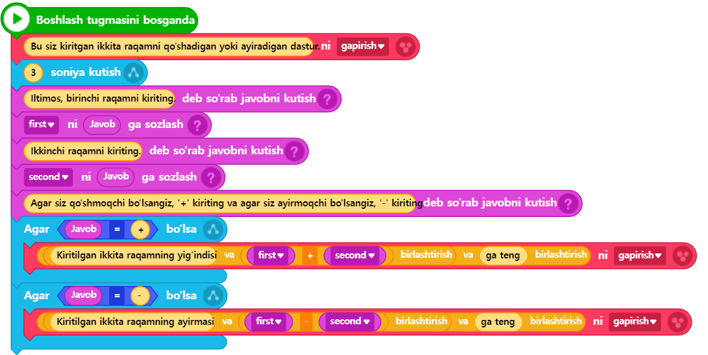
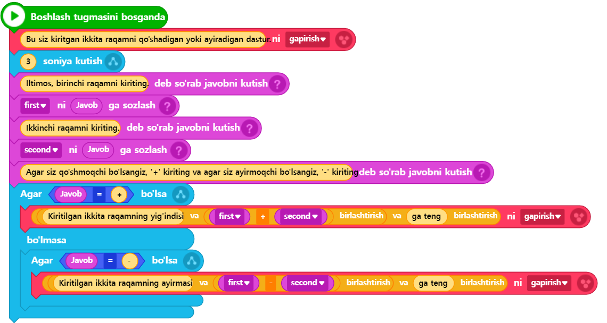
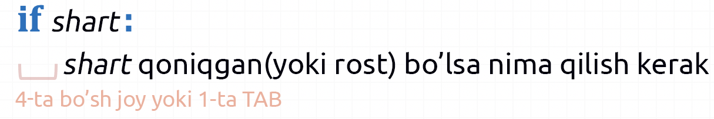
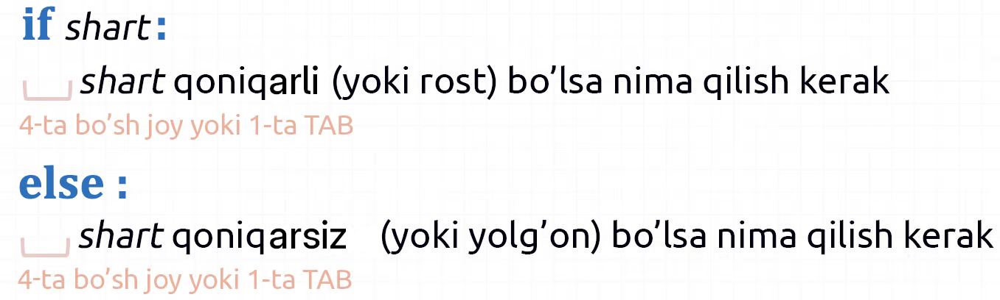
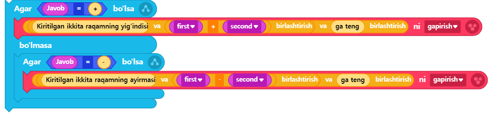

# 3.4 Shart (Condition)

Blok kodlashda juda ko‘p ishlatiladigan ikki xil blok mavjud: "**Agar \~ bo‘lsa**" va "**Agar \~ bo‘lsa, bo'lmasa \~**". Ularning vazifasi shundaki, bizning kodimiz ketma-ket bajarilayotganida, ma’lum bir shartga qarab, ba’zi harakatlarni bajarish yoki bajarmaslikni ta’minlashdir.

Oldingi bobda yaratilgan kalkulyator dasturida foydalanuvchidan kiritilgan ikkita tasodifiy qiymatni faqat qo‘shib berishdan tashqari, foydalanuvchiga yaxshiroq foydalanish imkoniyatini yaratish uchun, faqat qo‘shish emas, balki ayirishni ham amalga oshirish va qaysi amalni bajarishni tanlash imkoniyatini foydalanuvchiga taqdim etuvchi yaxshiroq dasturga rivojlantiraylik. Shuni yodda tutish kerakki, dasturiy ta’minot yaratish bir martalik jarayon bilan tugamaydi. U doimiy ravishda rivojlanib, yaxshilanib, yangi versiyalarni chiqara boradi. Bu jarayon dasturiy ta’minotning hayot sikli (software lifecycle) deb ataladi.



<figure><figcaption></figcaption></figure>



<figure><figcaption></figcaption></figure>




```python
# (1)Entrybot's Python code

import Entry

first = 0
second = 0

def when_start():
    Entry.print("Bu siz kiritgan ikkita raqamni qo'shadigan yoki ayiradigan dastur.")
    Entry.wait_for_sec(3)
    
    Entry.input("Iltimos, birinchi raqamni kiriting.")
    first = Entry.answer()
    Entry.input("Ikkinchi raqamni kiriting.")
    second = Entry.answer()
    
    Entry.input("Agar siz qo'shmoqchi bo'lsangiz, '+' kiriting va agar siz ayirmoqchi bo'lsangiz, '-' kiriting.")
    if Entry.answer() == "+":
        Entry.print("Kiritilgan ikkita raqamning yig'indisi " + (first + second) + " ga teng")
    if Entry.answer() == "-":
        Entry.print("Kiritilgan ikkita raqamning ayirmasi " + (first - second)) + " ga teng")
```




<figure><figcaption></figcaption></figure>




```python
# (1)Entrybot's Python code

import Entry

first = 0
second = 0

def when_start():
    Entry.print("Bu siz kiritgan ikkita raqamni qo'shadigan yoki ayiradigan dastur.")
    Entry.wait_for_sec(3)
    
    Entry.input("Iltimos, birinchi raqamni kiriting.")
    first = Entry.answer()
    Entry.input("Ikkinchi raqamni kiriting.")
    second = Entry.answer()
    
    Entry.input("Agar siz qo'shmoqchi bo'lsangiz, '+' kiriting va agar siz ayirmoqchi bo'lsangiz, '-' kiriting.")
    if Entry.answer() == "+":
        Entry.print("Kiritilgan ikkita raqamning yig'indisi " + (first + second)) + " ga teng")
    else:
        if Entry.answer() == "-":
            Entry.print("Kiritilgan ikkita raqamning ayirmasi " + (first - second)) + " ga teng")
```




Agar avvalgi dasturda 3-ta o‘zgaruvchi (first, second, result) ishlatilgan bo‘lsa, **bu safar o‘zgaruvchilar soni 2-ta (first, second) ga qisqartirildi.** Qisqartirish usuli shundan iboratki, avvalgi dasturda ikki qiymatning hisoblangan natijasi result o‘zgaruvchisiga saqlanib, keyin shu o‘zgaruvchidagi qiymat chiqarilgan bo‘lsa, bu safar hisoblash natijasi o‘zgaruvchi ishlatmasdan, bevosita **(first + second)** yoki **(first - second)** ko‘rinishida hisoblash ifodasini qavslar ichida yozilib, chiqarish funksiyasi (print funksiyasi) ichida to‘g‘ridan-to‘g‘ri hisoblash va natijani chiqarish amalga oshirildi.

🔢 17-qatorni ko‘rib chiqaylik. Foydalanuvchiga '**+**' yoki '**-**' belgilaridan birini tanlash va kiritish imkoniyati berilganligi sababli, foydalanuvchi ushbu amallardan birini to‘g‘ri kiritadi, deb faraz qilinadi. Foydalanuvchi tanlagan amal turiga qarab, kodni boshqacha bajarish talab qilinadi. Shu sababdan **shart operatori** ishlatilgan. Python tilida shart operatorini ishlatish sintaksisi quyidagicha bo‘ladi:

<figure><figcaption></figcaption></figure>

🔢 Keling, yuqorida keltirilgan sintaksisga asoslanib 18-19 qatorlardagi kodni tushuna olamizmi.

```python
if Entry.answer() == "+":
    Entry.print("Kiritilgan ikkita raqamning yig'indisi " + (first + second) + " ga teng")
```

[Oldingi bob](uzgaruvchi.md)da '==' belgisining (operatorining) ma’nosi tushuntirilgan edi. U chap va o‘ng tomondagi ikkita qiymatning tengligini tekshirish uchun ishlatiladigan operator bo‘lib, bu yerda foydalanuvchi kiritgan qiymatning '+' ekanligini aniqlash uchun ishlatilmoqda. Agar foydalanuvchi kiritgan qiymat '+' bo‘lsa, **if** bilan boshlangan qatordan keyingi kodlar bajariladi. Bu yerda kod yozishda e’tibor berilishi kerak bo‘lgan jihat — **biz oldingi** [**Hello World misoli**](hello_world.md)**ning tahlilida ko‘rganimizdek, if shartidan keyin ataylab bo‘shliq (odatda klaviaturada bo‘sh joy(spacebar) tugmasi bilan 4 marta yoki tab tugmasi bilan 1 marta bosish orqali yaratiladi) qoldirish lozim. Har bir qatorning bir xil hajmdagi bo‘shliq bilan boshlanishi, if sharti bajarilgan holda ishga tushiriladigan kodlar to‘plamining boshlanishi va tugash joylarini aniqlash imkonini beradi.** Shuning uchun, bo‘shliqlarni to‘g‘ri va aniq kiritishni yaxshi tushunib olish kerak.

🔢 Yuqorida shart operatorining ishlatilishi to‘liq tushunarli bo‘lsa, keyingi 20\~21-qator kodlarni tushunish juda oson bo‘ladi.

Oxirgi masala sifatida, yuqoridagi misol kodni blokli kodlash (1 va 2) va matnli dasturlash (1 va 2) ga ajratganimizning sababini tushuntirish lozim. 1 va 2 turdagi kodlar bir xil vazifani bajaradi, ammo ularning amalga oshirilish usulida ozgina farq bor. Shu bilan birga, bitta qo‘shimcha shart operatori sintaksisini tushuntirish maqsadi bor edi.

Agar biz blokli kodlashdagi "Agar \~ bo‘lsa" blokining matnli kodlashda qanday ifodalanishini o‘rgangan bo‘lsak, endi "Agar \~ bo‘lsa, bo'lmasa \~" blokining matnli dasturlashda ham mavjud ekanligini taxmin qilishimiz mumkin. Buni ishlatish sintaksisi quyidagicha bo‘ladi:

<div data-full-width="false"><figure><figcaption></figcaption></figure></div>

```python
if Entry.answer() == "+":
    Entry.print("Kiritilgan ikkita raqamning yig'indisi " + (first + second) + " ga teng")
else:
    if Entry.answer() == "-":
        Entry.print("Kiritilgan ikkita raqamning ayirmasi " + (first - second) + " ga teng")
```

Ushbu kodni quyidagicha ko'rsatilgan blokli kodlash bilan taqqoslash orqali osonroq tushunish mumkin:

<figure><figcaption></figcaption></figure>

Biroq, if\~else\~ ko‘rinishidagi matnli dasturlashda shart operatoridan foydalanishda ham oldingi kabi har bir kod qatorida bir xil bo‘shliq uzunligini saqlashga e’tibor qaratish kerak. **Blokli kodlashda shart operatorining boshlanishi va tugash joyi vizual tarzda aniq ko‘rsatilgani sababli, uni intuitiv tarzda tushunishimiz oson edi. Ammo matnli dasturlashda buni faqat matn orqali ifodalashda cheklovlar mavjud. Shu sababli, blokli kodlashda yopilgan kodlar to‘plami matnli dasturlashda har bir qatorni bir xil miqdorda bo‘shliq(identatsiya) bilan to‘g‘rilash orqali ifodalanishini tushunish lozim.**

<br>
