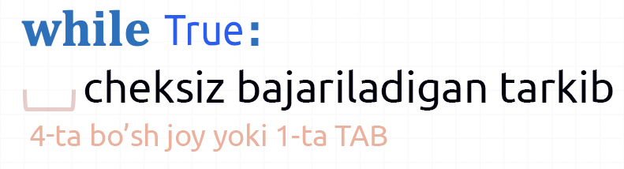
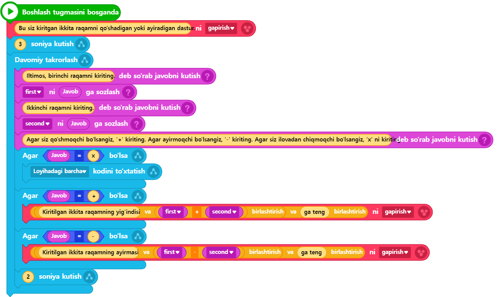

# 3.5 Takrorlash (Loop)

Biz blokli kodlashda kodning oqimini boshqarish maqsadida (shuning uchun Entryning blok kategoriyasida "**oqim**" kategoriyasiga kiradi) eng asosiy bloklardan biri bo‘lgan "**takrorlash**"ni ko‘p marta ishlatganmiz. Takrorlanishi kerak bo‘lgan kod qismini qanday va qancha marta takrorlash kerakligini aniqlash uchun Entryning "oqim" kategoriyasidagi takrorlash bilan bog‘liq bloklar uchta asosiy turga bo‘linadi: "davomiy takrorlash / belgilangan marta takrorlash / ma’lum bir shart davomida takrorlash".

Birinchi, "ma’lum bir shart davomida takrorlash"ni Python sintaksisida ifodalash quyidagicha bo‘ladi:

<figure><figcaption></figcaption></figure>

**while** inglizcha bog‘lovchining o‘zi ham "(biror narsa) **davomida**" degan ma’noni anglatadi. Shunday qilib, while operatorida yozilgan 'shart' qoniqarli bo’lishi davomida uning ostida joylashgan kodlar doimiy ravishda takroran bajariladi. Buni shunday tushunish mumkin: takrorlash amalga oshirilayotgan vaqt davomida har safar 'shart'ning bajarilayotganini yoki bajarilmayotganini tekshirish kerak. Shu vaqt davomida holat o‘zgarishi va shuning uchun 'shart'ning natijasi yolg'on bo'lib bajarilmay qolishi mumkin. O‘sha vaqtda takrorlash to‘xtatiladi, va while operatoridan chiqiladi. Shundan so'ng while kod to'plamidan keyin yozilgan kodlar ketma-ket bajarila boshlaydi.

Biz odatda takrorlash davomida 'shart' o‘zgarib, shu bilan birga 'shart'ning natijasi yolg’on bo’lib bajarilmay qolganda, takrorlashdan chiqishni kutamiz. Ammo, agar takrorlashni ataylab cheksiz davom ettirmoqchi bo‘lsak, nima qilish kerak? Buni shunday amalga oshirish mumkin: 'shart'ni hech qachon tekshirilmay qolmaydigan qilib belgilash. Boshqacha qilib aytganda, 'shart'ni doim **rost** (True) bo‘lishiga majbur qilish kerak. Buni Python tilidagi matnli dasturlash sintaksisi yordamida quyidagicha ifodalash mumkin:

<figure><figcaption></figcaption></figure>

Yuqorida o‘rganilgan texnikadan foydalanib, avvalgi bo‘limlarda yaratilgan kalkulyator dastur(yoki ilova)ini yanada takomillashtirib, foydalanuvchining foydalanish qulayligini oshirishga harakat qilamiz. Foydalanuvchi nuqtai nazaridan, kalkulyator yordamida hisoblash jarayonini faqat bir marta bajarish bilan cheklanmaslik, balki davom ettirish imkoniyati muhim. Hozirgi sharoitda foydalanuvchi hisoblashni qayta-qayta davom ettirmoqchi bo‘lsa, dastur(yoki ilova)ni qayta ishga tushirishdan boshqa yo‘li yo‘q. Bu esa foydalanish qulayligini cheklaydi. Foydalanuvchi istagancha hisoblashni davom ettira olishi va kerak bo‘lmaganida dasturni to‘xtata olishi kerak. Ushbu foydalanuvchi talablariga javob berish uchun, biz kodlarimizga takrorlash operatorini qo‘shishimiz zarur.



<figure><figcaption></figcaption></figure>



<figure><figcaption></figcaption></figure>




```python
# (1)Entrybot's Python code

import Entry

first = 0
second = 0

def when_start():
    Entry.print("Bu siz kiritgan ikkita raqamni qo'shadigan yoki ayiradigan dastur.")
    Entry.wait_for_sec(3)
	
    while True:
        Entry.input("Iltimos, birinchi raqamni kiriting.")
        first = Entry.answer()
        Entry.input("Ikkinchi raqamni kiriting.")
        second = Entry.answer()
		
        Entry.input("Agar siz qo'shmoqchi bo'lsangiz, '+' kiriting. Agar ayirmoqchi bo'lsangiz, '-' kiriting. Agar siz ilovadan chiqmoqchi bo'lsangiz, 'x' ni kiriting.")
        if Entry.answer() == "x":
            Entry.stop_code("all")
        if Entry.answer() == "+":
            Entry.print("Kiritilgan ikkita raqamning yig'indisi " + (first + second) + " ga teng")
        if Entry.answer() == "-":
            Entry.print("Kiritilgan ikkita raqamning ayirmasi " + (first - second) + " ga teng")
        Entry.wait_for_sec(2)
```




Endi yozilgan kodni tushunaylik. Takomillashtirilgan kalkulyator ilovasida cheksiz takrorlanishi kerak bo‘lgan kodlar **while True:** dan keyingi qatordan boshlab joylashganini va ularning barchasi **identatsiya**(indenting - 4 bo'sh joy yoki 1 tab orqali bo‘shliq qoldirish) bilan yozilganini ko‘rish mumkin. Foydalanuvchi bizning kalkulyator ilovamizni yopmoqchi bo‘lganida, unga ko‘rsatmalarda aytilganidek, 'x' qiymatini kiritadi. Ushbu qism kodning 19\~20-qatorlarida bajariladi. Agar foydalanuvchi 'x' qiymatini kiritgan bo‘lsa, Entry kutubxonasidagi dastur(ilova)ning kodlarni to‘xtatish funksiyasi bo‘lgan **stop\_code** funksiyasi chaqiriladi. Barcha kodlarni to‘xtatish uchun esa funksiyaga "all" argumenti yuborilganini ko‘rish mumkin.
