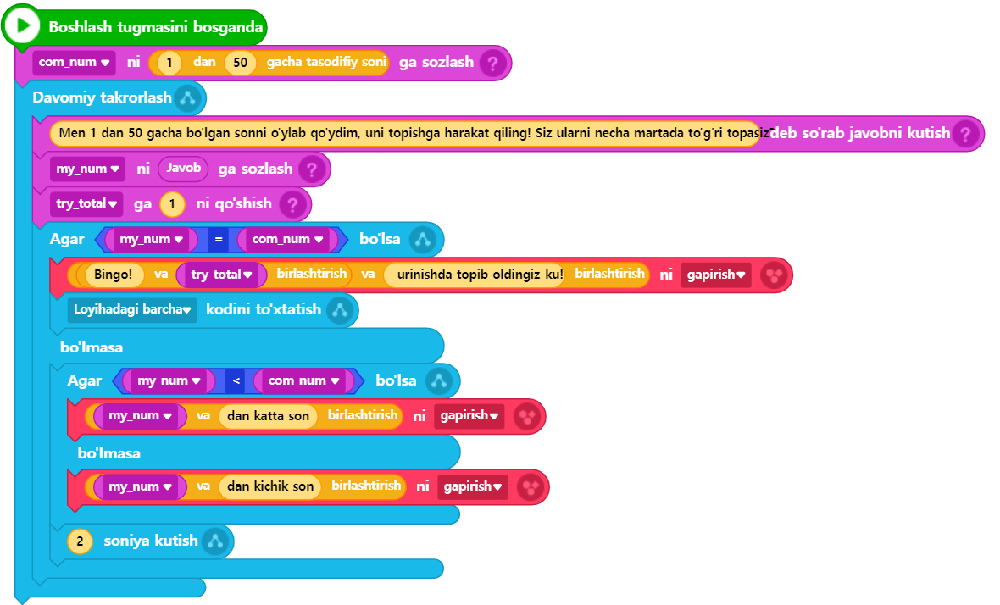

# 3.7 Tasodifiy son (Random)

Tasodifiy son (yoki random) funksiyasidan foydalanish faqat bitta funksiya chaqiruviga asoslangani sababli, hozirgacha berilgan ma'lumotlarni yaxshi tushungan va kuzatib kelgan odamlar uchun umuman qiyinchilik tug‘dirmaydi. Shunday qilib, ushbu bo‘limda oddiy va qiziqarli bir o‘yin yaratamiz, bunda tasodifiy son funksiyasidan foydalanamiz.

O‘yin nomi "Men o'ylagan sonni top!" bo‘lib, kompyuter 1 dan 50 gacha bo‘lgan tasodifiy bir sonni o‘ylaydi, va biz ushbu sonni imkon qadar kam urinishda topishimiz kerak bo‘ladi. O‘yinni yanada qiziqarliroq qilish uchun biz foydalanuvchining kiritgan taxminiy soni to‘g‘ri javobga qanchalik yaqin ekanligi haqida doimiy ravishda maslahatlar beradigan mexanizmni qo‘shamiz.



<figure><figcaption></figcaption></figure>



<figure><figcaption></figcaption></figure>




```python
# (1)Entrybot's Python code
import Entry

com_num = 0
my_num = 0
try_total = 0

def when_start():
    com_num = random.randint(1, 50)
	
    while True:
        Entry.input("Men 1 dan 50 gacha bo'lgan sonni o'ylab qo'ydim, uni topishga harakat qiling! Siz ularni necha martada to'g'ri topasiz?")
        my_num = Entry.answer()
        try_total += 1
		
        if (my_num == com_num):
            Entry.print("Bingo! " + try_total + "-urinishda topib oldingiz-ku!")
            Entry.stop_code("all")
        else:
            if my_num < com_num:
                Entry.print(my_num + " dan katta son")
            else:
                Entry.print(my_num + " dan kichik son")
            Entry.wait_for_sec(2)
```




🔢 9-qatorida tasodifiy son yaratish uchun **randint** funksiyasidan foydalanilgan. Ushbu funksiya **random** modulida (yoki kutubxonasida) joylashgan bo‘lib, asl Pythonda ushbu modulni chaqirish uchun kodning eng yuqori qismida **import random** qatori qo‘shilishi kerak bo‘lardi. Biroq, Entry-Pythonda ushbu jarayonsiz ham ushbu funksiyani to‘g‘ridan-to‘g‘ri chaqirib foydalanish mumkin. _Funksiyaga uzatilgan qiymatlar qaysi oraliqda tasodifiy son kerakligini aniq belgilash uchun berilgan: 1 dan 50 gacha bo‘lgan butun sonlar oraliqni anglatadi, shuning uchun **randint(1, 50)** chaqiruviga boshi va oxiri sifatida ikkita qiymat funksiya argumentlariga uzatilgan._

🔢 14-qatorida **try\_total += 1** qatorida notanish **+=** operatori ishlatilgan, lekin aslida bu operatorning ishlatilishi oldingi bo‘limda ro‘yxatlar bilan ishlash misolida ko‘rsatilgan kodga o‘xshaydi. U yerda umumiy summani hisoblashda avvalgi qiymatga yangi qiymat qo‘shib borilgan edi. Shunday qilib, agar kodni **try\_total = try\_total + 1** shaklida yozsangiz, u xuddi shunday ishlaydi, va bu kodni qisqartirilgan holda **try\_total += 1** shaklida yozish ham aynan shu ma’noni beradi. Ya’ni, **try\_total** ning oldingi qiymatiga ketma-ket 1 qo‘shib borilsin degan ma’noni anglatadi.

Boshqa kodlar ilgari o‘rganilgan bo‘lib, ularni tushunishda katta qiyinchilik bo‘lmasligi kutiladi. Shuning uchun qo‘shimcha izohlar berishga hojat yo‘q, va endi ushbu o‘yinni yanada qiziqarli qilish uchun uni rivojlantirish sizning vazifangiz bo‘lib qoladi.
