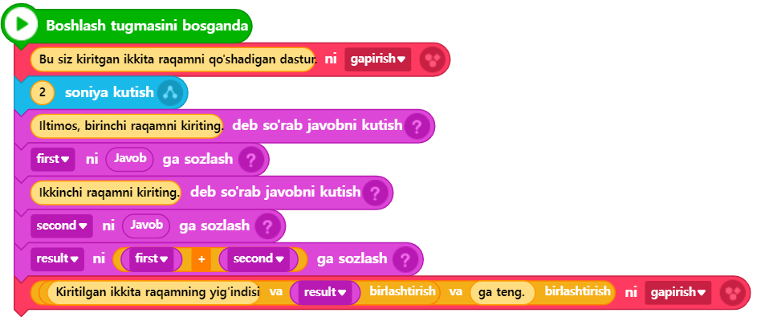

# 3.3 O‘zgaruvchi (Variable)

Biz Entry blokli kodlashda o‘zgaruvchi va ro‘yxat deb nomlangan elementlarni ishlatib ko‘rganmiz. Ikkalasi ham ma'lumotlarni saqlash uchun mo‘ljallangan joy bo‘lib xizmat qiladi. Avval o‘zgaruvchining nima ekanligini va uning maqsadi nimadan iboratligini eslab olaylik. \
O‘zgaruvchi — nomidan ma’lum bo‘lgandek, o‘zgaruvchi qiymatlarni vaqtinchalik saqlash uchun ajratilgan joy. Blokli kodlashda biz ba'zi bloklarni qo‘llaganimizda, ko‘pincha oldindan belgilangan biror amalni bajarish uchun muayyan qiymatlar aniqlab berilganini ko‘ramiz. Ammo, oldindan belgilab bo‘lmaydigan qiymatlar (masalan, foydalanuvchi tomonidan kiritilgan tasodifiy qiymatlar) asosida ishlaydigan dasturlar uchun o‘zgaruvchilardan foydalanish zarur bo‘ladi.

Yuqorida aytib o‘tilgan misolga o‘xshash holda, foydalanuvchi tomonidan tasodifiy kiritilgan ikki raqamni qabul qilib, ularning yig‘indisini hisoblashga qaratilgan oddiy qo‘shish kalkulyatori dasturini o‘zgaruvchidan foydalanib yozamiz.



<figure><figcaption></figcaption></figure>



<figure><figcaption></figcaption></figure>




```python
# (1)Entrybot's Python code

import Entry

first = 0
second = 0
result = 0

def when_start():
    Entry.print("Bu siz kiritgan ikkita raqamni qo'shadigan dastur.")
    Entry.wait_for_sec(2)
    
    Entry.input("Iltimos, birinchi raqamni kiriting.")
    first = Entry.answer()
    Entry.input("Ikkinchi raqamni kiriting.")
    second = Entry.answer()
    
    result = (first + second)
    Entry.print(("Kiritilgan ikkita raqamning yig'indisi " + result) + " ga teng.")
```




Biz hali matn dasturlash bilan yaxshi tanish bo'lmaganimiz sababli, kod miqdori to'satdan ko'payib ketgandek tuyulishi mumkin, lekin aslida bu o'qishni oshirish uchun ataylab bo'sh qatorlar bilan kod bo'laklariga ajratilgan, shuning uchun qatorlar soni katta tuyulishi mumkin, agar siz uni diqqat bilan izohlasangiz, unda murakkab tarkib deyarli yo'qligini ko'rasiz.

Hozirgacha o‘rganilmagan, birinchi marta uchrayotgan qism — bu 5\~7-qatorlarda yozilgan 3 ta kod qatoridir. Ushbu qatorlarda **first**, **second**, va **result** deb nomlangan 3 ta o‘zgaruvchi e'lon qilinadi va ushbu o‘zgaruvchilarga dastlabki qiymat sifatida 0 belgilanadi. **Python tilida o‘zgaruvchi yaratish sintaksisi quyidagicha:**

> o'zgaruvchi nomi = _boshlang'ich qiymat_

_Bu yerda o‘zgaruvchi nomini kerakli, tasodifiy bir nom bilan belgilash mumkin, lekin maqsadga muvofiq, kodni o‘qishda uning vazifasini osongina tushunish uchun mazmunli nom tanlash tavsiya etiladi. Yuqoridagi misolda foydalanuvchining birinchi kiritgan qiymati (first), ikkinchi kiritgan qiymati (second), va ushbu ikkita qiymatning yig‘indisi (result) ma’nosini ifodalash uchun ushbu o‘zgaruvchi nomlari ataylab ishlatilgan. O‘zgaruvchilarga dastlab yaratilayotganda biron-bir tasodifiy qiymat (bunga "boshlang'ich qiymat" deyiladi) berilib, qiymatga ega holda ishga tushiriladi. Odatda, `0` dastlabki qiymat sifatida ishlatiladi. Ushbu sintaksisda e'tibor qaratish kerak bo‘lgan bir narsa bor: **'=' belgisining ma’nosi matematikadagi "teng" degan ma’noni emas, balki, '=' belgisining o‘ng tomonidagi qiymatni chap tomondagi o‘zgaruvchiga tayinlash (sozlash) degan ma’noni anglatadi. Buni albatta yodda saqlash lozim.**_

🔢 Shunday qilib, 5-qatordagi **first = 0** kodi, **`=`** belgining chap tomonida joylashgan **first** o‘zgaruvchisiga **`=`** belgining o‘ng tomonida joylashgan **0** qiymatini saqlashni anglatadi.


O‘zgaruvchi nomini ixtiyoriy tarzda ishlatish mumkin, deb aytilgan bo‘lsada, aslida Python dasturlash tilida o‘zgaruvchiga nom berishda rioya qilinishi kerak bo‘lgan 2 asosiy qoida mavjud:

* O‘zgaruvchi nomi raqam bilan boshlanishi mumkin emas.&#x20;
* O‘zgaruvchi nomi orasida bo‘sh joy bo‘lishi mumkin emas.


Bu yerda, matematik ma'noda chap va o‘ng tomondagi qiymatlar bir-biriga tengmi yoki yo‘qligini kodda ifodalash uchun qanday belgi ishlatish kerakligi qiziq bo‘lishi mumkin. Bu holatda **==** belgisi ishlatiladi. **Ya'ni, `=` belgisini bitta emas, ketma-ket ikki marta ishlatish orqali chap va o‘ng tomondagi qiymatlarning bir-biriga tengligini solishtirish ma'nosini anglatadi.**

🔢 10\~11-qatordagi kodlar to‘plami dasturda foydalanuvchiga dasturimizning qanday dastur ekanligini tushuntirish uchun foydalaniladi. 10-qatordagi chiqarish funksiyasi ilgari ishlatilgan, 11-qatordagi **Entry.wait\_for\_sec(2)** kodi esa birinchi marta uchraydi. Uning ma’nosini tushunish qiyin emas: bu Entry kutubxonasidagi **wait\_for\_sec** funksiyasini chaqirishdir. Ushbu funksiya blok kodlashdagi "\~ soniya kutish" blokiga o‘xshaydi. Kutish davomiyligini funksiyaga qiymat sifatida uzatish kerak, va bu yerda 10-qatorda chiqarilgan matnni ekranda 2 soniya davomida ko‘rsatib turish uchun 2 qiymati berilgan.

🔢 13\~16-qatordagi kodlar to‘plami foydalanuvchidan ketma-ket ikkita tasodifiy son kiritishni so‘raydi va ularni mos ravishda **first** va **second** o‘zgaruvchilariga saqlaydi. Nima uchun foydalanuvchi kiritgan qiymatni Entry.answer() orqali o‘qib, saqlash kerakligi haqida avvalgi bobda[ kiritish-chiqarish funksiyalari](kiritish_chiqarish.md) qismida tushuntirilgan.

🔢 18-qatorda esa **first** va **second** o‘zgaruvchilarida saqlangan qiymatlar o‘qilib, ularning yig‘indisi uchinchi o‘zgaruvchi, ya'ni **result** ga saqlanadi.

🔢 19-qator kodda foydalanuvchi kiritgan ikki sonning yig‘indisi saqlangan o‘zgaruvchidagi qiymatni foydalanuvchiga ko‘rsatish orqali dastur o‘z maqsadiga erishadi va yakunlanadi.

Agar biz blokli kodlashda o‘zgaruvchilarni ishlatgan bo‘lsak, ularning ma’nosi va qo‘llanilishini yaxshi bilamiz. Matnli dasturlashga o‘tilganda ham bu ma’no va maqsad umuman o‘zgarmaydi. Faqatgina matnli dasturlashda (bu yerda Python) foydalanilganda, shu tilning o‘zgaruvchi ishlatish sintaksisiga amal qilib, foydalanish kifoya.

<br>

<br>
