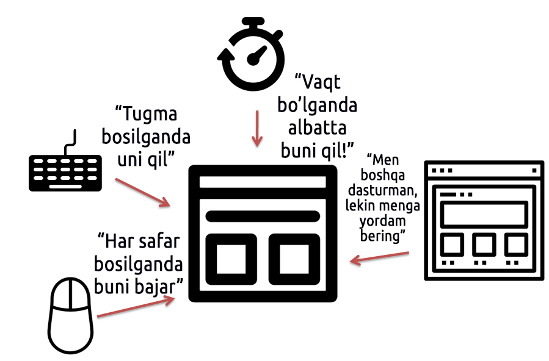

# 4.3 Hodisaga asoslangan (Event-Driven)

Keling, **hodisaga asoslangan**(Event-Based) **yoki hodisaga yo‘naltirilgan dasturlash paradigma**si haqida gaplashamiz. Ushbu paradigma keng qo‘llanila boshlagan davr operatsion tizimlar(OS: Operating System) interfeyslari **konsol**(Console) matnli buyruqlari orqali ishlashdan **grafik foydalanuvchi interfeysi**(GUI: Graphic User Interface)ga o‘tish davriga to‘g‘ri keladi. Boshqacha aytganda, GUI muhitiga mos dasturlar kerak bo‘ldi, va dastur ishlab chiqish usullari ham shu ehtiyojlarga mos ravishda rivojlandi. **GUI muhiti** deganda grafik asosida ishlaydigan tizim tushuniladi. Masalan, kompyuter yoki smartfonlarda biz bosish yoki teginish orqali tanlovlar va boshqaruvlar amalga oshiramiz. Bugungi kunda bu kompyuterni boshqarishning keng tarqalgan usuli bo‘lib, ushbu paradigmadan foydalanishni tushunish qiyinchilik tug‘dirmaydi. Shunga qaramay, hodisaga yo‘naltirilgan dasturlash konsepsiyasini quyidagi rasm yordamida yaxshiroq tushunishga harakat qilaylik.

<figure><figcaption>
Manba: <a href="https://kamang-it.tistory.com/entry/%ED%94%84%EB%A1%9C%EA%B7%B8%EB%9E%98%EB%B0%8D-%ED%8C%A8%EB%9F%AC%EB%8B%A4%EC%9E%84%EC%9D%B4%EB%B2%A4%ED%8A%B8-%EA%B8%B0%EB%B0%98-%ED%94%84%EB%A1%9C%EA%B7%B8%EB%9E%98%EB%B0%8DEvent-based-programming">Kamang's IT Blog</a>
</figcaption></figure>

**Hozir ekranda ko‘rinib turgan dasturimda biror harakatni qo‘zg‘atuvchi(trigger) barcha holatlar hodisa(event) deb ataladi. Masalan, foydalanuvchi ekranda ma'lum bir rasmli tugmani yoki belgini bosgan payt, klaviaturada ma'lum bir tugmacha(harf, maxsus belgi, yo‘nalish tugmalari va boshqalar)ni bosgan payt, sichqonchaning ma'lum bir tugmachasi(chap, o‘rta, o‘ng)ni bosgan payt, belgilangan vaqtga yetgan payt yoki boshqa bir dastur mening dasturimni chaqirgan payt va shunga o‘xshash holatlar.**

Ya'ni, dasturchi bunday hodisalar sodir bo‘lishini oldindan taxmin qilib, har bir hodisa sodir bo‘lganda qaysi vazifani bajarish kerakligini ko‘rsatadigan tarzda kod yozishni **hodisaga asoslangan dasturlash paradigam**si deb atash mumkin. Biz allaqachon Entry platformasida shu usulda kod yozish tajribasiga egamiz, shuning uchun ushbu tushunchani anglash yoki amalda qo‘llashda qiyinchilik bo‘lmaydi, deb o‘ylayman. Faqatgina, Entry-Pythonda bu kabi hodisalar uchun qanday funksiyalardan foydalanish kerakligini bilishimiz kifoya.

Quyidagi jadvalda Entryda mavjud bo‘lgan hodisalar turlari va ushbu hodislarga mos keladigan, oldindan aniqlangan(kelishilgan) **kolbek(callback) funksiyalar** ([3.1-bo‘limdagi kolbek funksiyalarga qarang](../boshlash/hello_world.md#kolbek-callback-funksiyasi-nima)) ro‘yxatini ko‘rishingiz mumkin.

| Hodisa turi                             | Blokli kodlashdagi bloklar                                               | Matnli kodlash uchun kolbek funksiyasi |
| --------------------------------------- | ------------------------------------------------------------------------ | -------------------------------------- |
| Ekrandagi boshlash tugmasini bosganda   |       | def when\_start():                     |
| Klaviaturadagi tugmacha bosilganda      |   | def when\_press\_key("q"):             |
| Sichqoncha bosilganda                   |   | def when\_click\_mouse\_on():          |
| Sichqonchani bosishni qo‘yib yuborganda |  | def when\_click\_mouse\_off():         |
| Obyektni bosganda                       |    | def when\_click\_object\_on():         |
| Obyektni bosishni qo‘yib yuborganda     |   | def when\_click\_object\_off():        |
| Yangi sahna boshlanganda                |     | def when\_start\_scene():              |

