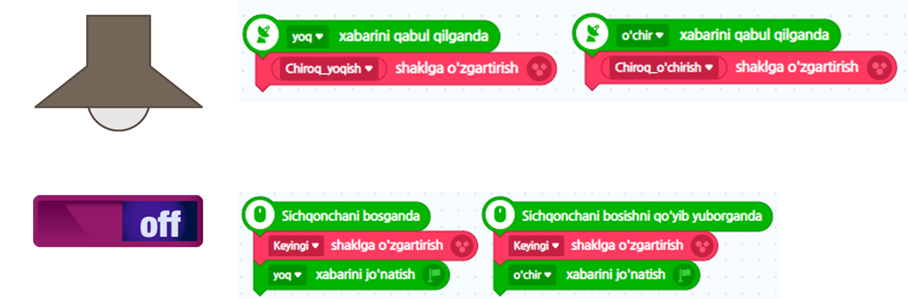

# 4.4 Obyektga yo‘naltirilgan (Object-Oriented)

Nihoyat, **obyektga yo‘naltirilgan(Object-Oriented, OOP)** **dasturlash paradigmasi** haqida gaplashaylik. Ushbu paradigma dasturiy ta'minot ishlab chiqishda eng katta ta'sir ko‘rsatgan innovatsion paradigmalardan biri sifatida qaraladi, ayniqsa dastur hajmi katta yoki ko‘plab dasturchilar bilan hamkorlikda ishlash zarurati bo‘lganda keng qo‘llaniladi. Shuning uchun uni yaxshi tushunish va bilish zarur. Biroq, bu tushunchani to‘g‘ri tushunish va erkin qo‘llash uchun chuqur tushuncha kerak, va agar chuqurroq kirib borsangiz, ba'zi joylarda qiyinchiliklar yuzaga kelishi mumkin. Lekin bunday chuqur tushunchani keyinchalik kerakli paytda o‘rganish mumkin, shuning uchun Entry-Pythonda asosiy va nazariy tushunchalarni tushunish kifoya qiladi. Bu, ayniqsa, matnli dasturlashni boshlashda katta foyda keltirishi mumkin.

Avvalgi bo‘limlarda tilga olingan paradigmalarni, ularning nima ekanini bilmasdan, tabiiy ravishda o‘rganganimiz kabi, Entry dasturi dastlab yaratilganidan boshlab, bizni bu paradigmalarni qiyinchiliksiz qabul qilishimiz uchun yaxshi o‘ylangan dizayn mavjud bo‘lgani ko‘rinadi. Avvalo, biz Entryda kod yozishdan oldin, eng avvalo bajarishimiz kerak bo‘lgan ish nima edi, shuni eslab ko‘raylik. Ha, bu ekraniga kamida bitta obyekt qo‘shish edi. Bu yerda **obyekt(Object)** atamasini joriy qilishdan boshlash, aslida, bu tushunchani tushuntirish uchun yaxshi tuzilgan ssenariy bo‘lgani haqida o‘ylayman.

Entryda bajarish ekranida ko‘rinadigan barcha narsa obyekt hisoblanadi. _**Faqat rasm yoki obyekt ekanligini aniqlash, aslida, o‘sha elementga mustaqil kodlar qo‘shib, uni boshqarish imkoniyati**ga bog‘liq._ Biz Entry blokli kodlashni boshlaganimizda, turli xil obyektlar(rasmlar, matnli obyektlar, jumladan fon obyektlari)ni olib, ularni ekraningizda joylashtirishdan boshlagandik.

Va, bu joylashtirilgan har bir obyektni jonlashtirish uchun har bir obyektga mos keladigan mustaqil kodlar yoziladi. Ba'zan, obyektlar bir-birlari bilan hamkorlik qilishlari kerak bo‘lsa, obyektlar orasida bir-biriga so‘rov yuboruvchi xabarlar almashish orqali o‘zaro hamkorlikni yaratib, butun dasturni ishlab chiqish tarzida kod yozilgan. Hozirgacha tilga olingan barcha jarayonlar aslida obyektga yo‘naltirilgan dasturlash paradigmidan foydalanish jarayoni edi va bu dasturlash tili dunyosida **obyektga yo‘naltirilgan dasturlash (OOP: Object Oriented Programming)** deb ataladi va ko‘pincha o‘ziga xos nom kabi tilga olinadi.

Endi, misol yordamida obyektlarning o‘zaro hamkorlik qilish uchun xabar almashadigan kodni ko‘rib chiqaylik.



<figure><figcaption></figcaption></figure>



<figure><figcaption></figcaption></figure>



<figure><figcaption></figcaption></figure>



Aslida, haqiqiy matnli dasturlash asosida obyektga yo‘naltirilgan dasturlashda hamkorlik jarayoni yuqorida ko‘rsatilgan xabar almashish usuli o‘rniga, har bir obyekt ichida mavjud bo‘lgan tashqi interfeys funktsiyalarini tashqi obyektlar tomonidan to‘g‘ridan-to‘g‘ri chaqirilishi orqali amalga oshiriladi. Hozirgi tushuntirish obyektga yo‘naltirilgan dasturlash paradigmasining chuqur tushunilishini talab qiladigan mavzu bo‘lgani uchun, bu mavzuni bu yerda batafsil tushuntirish kitobning doirasiga kiravermaydi. Agar bu mavzu qiziqarli bo‘lsa, obyektga yo‘naltirilgan dasturlash paradigmalariga bag‘ishlangan maxsus kitoblarni o‘qish va Python tilida obyektga yo‘naltirilgan dasturlashni qanday amalga oshirishni o‘rganishni tavsiya qilaman.

## Epilog

Shunday qilib, ushbu kitobning oxirigacha yetib kelganingiz uchun sizlarga samimiy tabriklayman va mehnatingizga e'tibor qaratishingizni istardim. Endi sizlar matnli dasturlash dunyosiga kirib keldingiz, yana bir bor tabriklayman. Muallif sizlarning matnli dasturlash olamidagi qiziqarli sayohatingizni qo‘llab-quvvatlash uchun [keyingi darajadagi kitob](https://roboticsware.gitbook.io/pygame_zero-entry_basic)ni yozishda davom etmoqda. Ushbu kitob ham dunyodagi ko‘plab insonlarning fikrlash va tafakkur ufqlarini kengaytirishda, erkin bo‘lishda yordam berib, ularga foyda keltirishini tilayman. 2023 yil kuzining so‘nggi lahzalarida... Muallifdan
